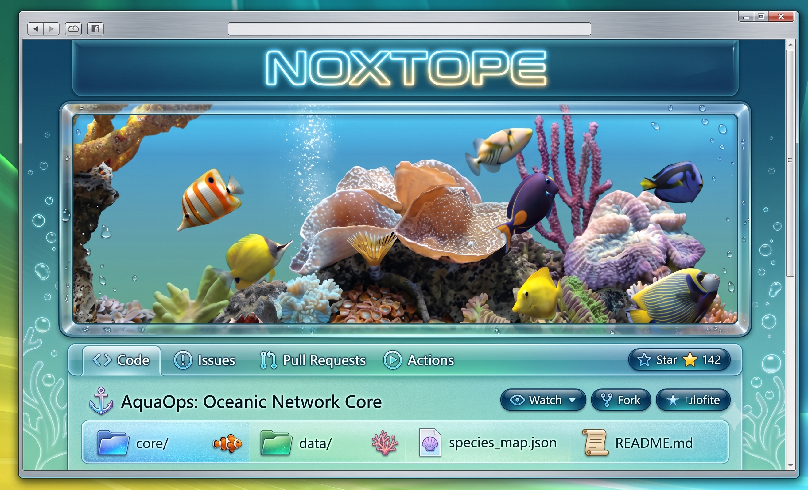

  

   

  <h1> 🫧 🌟 NOXTOPE 🌟 🫧 </h1>
  
<b><i>Sistemas, Desarrollo & Estética Digital</i></b>

  
🌊 🌿 🧊 🔬 🌿 🌊

### 🌐 Sobre Mí / Overview

¡Hola! Bienvenido a mi entorno digital. Soy un desarrollador enfocado en la creación de software, interfaces interactivas y automatización. Me apasiona explorar la intersección entre la tecnología moderna y las estéticas visuales de la era digital clásica.

- 🐟 **Enfoque:** Desarrollo de aplicaciones, lógica de software y optimización de sistemas.
- 🌱 **Intereses:** Visión computacional, entornos de red eficientes y diseño de interfaces limpias y dinámicas.
- 🧪 **Filosofía:** Crear código transparente, fluido y altamente funcional, manteniendo siempre una atención meticulosa al detalle visual.

 

### 🛠️ Tecnologías & Herramientas

Para lograr que los proyectos funcionen con la mayor fluidez posible, utilizo un stack dinámico enfocado en el rendimiento y la adaptabilidad:

  
  
  
  

 

### 🌊 Estadísticas de GitHub

  
  

 

  
<i>"Diseñando el futuro con la fluidez del agua."</i>

  

